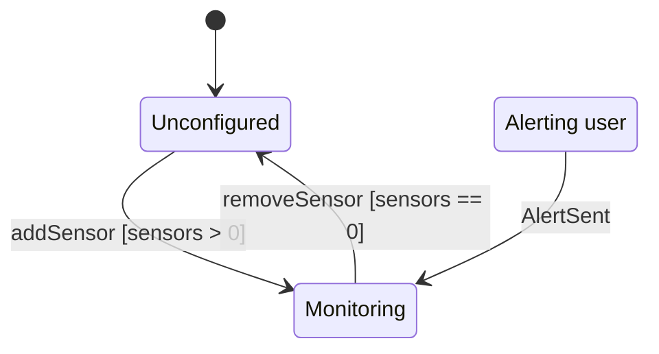
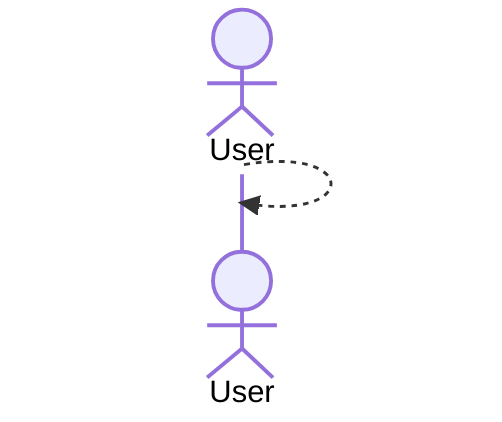

# Cabin monitor — analysis of the revised input set (v2)

**Date:** 2026-10-09 · **Scope:** the five drawings in [`project/diagrams/input/`](../project/diagrams/input/) as of commit `6092ffb` · **Status:** exploration complete, implementation not started · **Supersedes:** [2026-09-29 analysis](2026-09-29-cabin-monitor-input-set-analysis.md)

This document records what the revised input set says, where it is ambiguous, contradictory or
incomplete, which assumptions an implementation has to make, and how the implementation in
`project/impl/` will treat the drawings as ground truth.

Every parse result quoted below was produced read-only with the repository's own verifier code
(`umlverify.<flow>.drawio_read.read` and `umlverify.flow_for`), so it is exactly what
[`tools/verify.py`](../tools/verify.py) will compare an implementation against. The commands are in
[§16](#16-how-the-findings-were-produced).

---

## 1. Summary

The input set describes a **cabin monitoring system**: a user owns cabins; each cabin owns
temperature, power and security sensors; on every measurement interval the cabin reads each sensor,
asks the sensor whether the reading must raise an alert (each sensor type has its own, user-configurable
thresholds), creates an alert for every positive answer and returns the alerts to the user.

The revision fixed most of what the 2026-09-29 analysis raised (the `TermperatureSensor` typo, the
accidental italics, the `«enumeration»` stereotype, the free-floating state machine). The class
diagram now carries the behaviour that the other diagrams draw, so **no separate mock-up layer is
needed**.

| Diagram | Verdict |
|---|---|
| Class | Implementable and coherent. **As drawn, about 70 % alignment** is achievable (53 of 76 elements), because of two label placements, the undrawn state-machine members of `Cabin`, and the getters decided on (§4). With the drawing fixes in §4 it reaches 100 %. |
| State machine (`state-cabin`) | Verified (owner `Cabin`). 3 of 6 transitions are read; the 3 around the choice diamond are skipped. **As drawn ≈ 62 %** (8 of 13) with the choice flattened (§6). |
| Sequence | **Not verified**: the file name is not `sequence-<scenario>.drawio`, and even under the right name **0 of 17 messages are read** — every arrow has free endpoints (§7). |
| Activity, use case | Not verified (no flow exists for them). Used as requirements (§8, §9). |

**Decisions taken** (2026-10-09, with the user):

1. **Implement as drawn**; never edit `project/diagrams/input/`. Each unavoidable deviation is
   recorded here with its report cost and a one-line drawing fix the team can apply.
2. **Const getters** give read access to private attributes; they are accepted as class-report
   *Extras*. They are kept off the drawn `checkSensors()` call path where possible (§7.4).
3. **Ownership:** propose to the team that `Sensor → Reading` and `User → Alert` become
   **composition**; until they decide, implement the drawn associations with a documented
   owner outside the drawn classes (§5.1).
4. **Sensor values and time** come from a **free-function seam** (`hardware.hpp`, no class),
   replaceable in tests and scenarios. Not compared by the class verifier, not traced as messages.
5. The state machine's **choice diamond is flattened** into two guarded rows.
6. **Tests:** doctest, vendored as a single header; built only when a CMake option is on.
7. **Scope:** the verified core in `project/impl/`, its tests and CI. The WebAssembly dashboard of
   the 2026-09-29 plan is dropped.

**Most important open questions** (full list in §15): who adds alerts to a `User` and who owns
readings and alerts (Q1, Q2); who fires `AlertSent` (Q4); the threshold defaults and the
security/power semantics (Q6, Q7); whether the team applies the drawing fixes (Q11).

---

## 2. Inventory

| File | Diagram | Last changed (commit, author) | Handled by `tools/verify.py`? |
|---|---|---|---|
| [`class.drawio`](../project/diagrams/input/class.drawio) | Class | `b6eed1a` MaggyBoy | **Yes** — class-diagram flow |
| [`state-cabin.drawio`](../project/diagrams/input/state-cabin.drawio) | State machine of `Cabin` | `9bf33db` Safe-IV | **Yes** — state flow, class `Cabin` |
| [`Sequence_diagram.drawio`](../project/diagrams/input/Sequence_diagram.drawio) | Sequence | `6092ffb` Sergiu Sturza | **No** — `flow_for()` returns `None`: the name must be `sequence-<scenario>.drawio` |
| [`activity_diagram_2.drawio`](../project/diagrams/input/activity_diagram_2.drawio) | Activity | `5cb5f32` Sergiu Sturza | **No** — diagram type not supported |
| [`usecase.drawio`](../project/diagrams/input/usecase.drawio) | Use case | `779b790` Masopp | **No** — diagram type not supported |

**Changes since the 2026-09-29 analysis**

| Then | Now |
|---|---|
| `TermperatureSensor` (typo) | `TemperatureSensor` |
| `Alert`, `Cabin`, `Reading`, `User`, `Severity` italic (read as abstract) | Only `Sensor` is abstract; `Severity` is a proper «enumeration» |
| `Sensor::read()` not abstract | `read()` and the new `shouldAlert()` abstract |
| `User --> "*" Cabin` | `User *-- "*" Cabin` (composition) |
| `Cabin o-- "*" Sensor` (aggregation) | `Cabin *-- "*" Sensor : sensors` (composition) |
| `Reading --> "0..1" Alert` | removed; `Cabin ..> Alert : creates` added |
| `User.email`, `login()`, `viewData()` | removed; `addCabin`, `removeCabin`, `getCabins`, `getAlerts` added |
| `StateMachine.drawio` (no owner) | `state-cabin.drawio` (owner `Cabin`) |
| `sequence-monitoring_cycle.drawio` (9 lifelines, prose) | `Sequence_diagram.drawio` (class lifelines, method names) |

---

## 3. Class diagram as the verifier reads it

### 3.1 Classifiers

| Class | Kind | Attributes | Methods |
|---|---|---|---|
| `Sensor` | abstract | `- id: int`, `- name: String` | `+ read(): Reading` *abstract*, `+ shouldAlert(r: Reading): boolean` *abstract*, `+ getReadings(): Reading[]` |
| `TemperatureSensor` | class | `- minThreshold: double`, `- maxThreshold: double` | `+ read(): Reading`, `+ shouldAlert(r: Reading): boolean`, `+ setThreshold(min: double, max: double): void` |
| `PowerMeter` | class | `- threshold: double` | `+ read(): Reading`, `+ shouldAlert(r: Reading): boolean`, `+ setThreshold(t: double): void` |
| `SecuritySensor` | class | — | `+ read(): Reading`, `+ shouldAlert(r: Reading): boolean` |
| `Reading` | class | `- time: DateTime`, `- value: double` | — |
| `Alert` | class | `- id: int`, `- time: DateTime`, `- severity: Severity`, `- message: String` | — |
| `User` | class | `- id: int`, `- name: String` | `+ addCabin(c: Cabin): void`, `+ removeCabin(id: int): void`, `+ getCabins(): Cabin[]`, `+ getAlerts(): Alert[]` |
| `Cabin` | class | `- id: int`, `- name: String`, `- location: String` | `+ addSensor(s: Sensor): void`, `+ removeSensor(id: int): void`, `+ getSensors(): Sensor[]`, `+ checkSensors(): Alert[]` |
| `Severity` | enumeration | `LOW`, `MEDIUM`, `HIGH` | — |

**55 design elements:** 9 classes, 19 attributes and literals, 19 methods, 8 relations.

### 3.2 Relations

| Parsed | Meaning | Planned C++ member |
|---|---|---|
| `Sensor <\|-- TemperatureSensor`, `PowerMeter`, `SecuritySensor` | inheritance | `class PowerMeter : public Sensor` |
| `User *-- "*" Cabin` *(no role name, §4.1)* | composition, many | `std::vector<std::unique_ptr<Cabin>> cabins_;` |
| `Cabin *-- "*" Sensor : sensors` | composition, many | `std::vector<std::unique_ptr<Sensor>> sensors_;` (polymorphic, so `unique_ptr`, not by value) |
| `Sensor --> "*" Reading : readings` | association, many | `std::vector<Reading*> readings_;` (owner: §5.1) |
| `User --> "*" Alert : alerts` | association, many | `std::vector<Alert*> alerts_;` (owner: §5.1) |
| `Cabin ..> Alert : creates` *(label, §4.2)* | dependency | none — implied by `checkSensors(): std::vector<Alert>` |

### 3.3 Type and signature mapping

| Design | C++ | Why it matches |
|---|---|---|
| `String` | `std::string` | types compare case-insensitively |
| `boolean` | `bool` | normalized (`boolean` → `bool`) |
| `int`, `double` | `int`, `double` | |
| `T[]` (return) | `std::vector<T>` or `const std::vector<T*>&` | `T[]` and `vector<T>` both normalize to `list<T>`; `*` and `&` are dropped |
| `getSensors(): Sensor[]` | `const std::vector<std::unique_ptr<Sensor>>& getSensors() const` | the extractor collapses `unique_ptr<T>` anywhere in a signature; no copy, no allocation |
| `addSensor(s: Sensor)` | `void addSensor(std::unique_ptr<Sensor> s)` | an abstract class cannot be passed by value; a `unique_ptr<T>` parameter canonicalizes to `T` |
| `addCabin(c: Cabin)` | `void addCabin(std::unique_ptr<Cabin> c)` | same; transfers ownership into the composition |
| `shouldAlert(r: Reading)` | `bool shouldAlert(const Reading& r) const` | `const T&` is fine; `const` is recorded, not compared |
| `DateTime` | `using DateTime = std::chrono::sys_seconds;` in `date_time.hpp` | an alias adds no class. **To confirm on the first run** that libclang spells the field type `DateTime`, not the underlying type |
| `Severity` | `enum class Severity { LOW, MEDIUM, HIGH };` | enums are attributes, never relations |

All code lives in `namespace cabin`, headers in `include/cabin/`.

---

## 4. Conflicts between the class diagram and the verifier

Each item: evidence, plan under decision 1, cost in `class-report.md`, and the drawing fix.

### 4.1 The `cabins` role name is at the wrong end

- **Evidence:** on the `User → Cabin` edge the label `cabins` sits at `x = -0.27`, the User end, so
  it is read as a near-end label and the relation has no name. A relation's identity is
  *(source, target, label)* ([elements.py:25-27](../tools/umlverify/class_diagram/elements.py#L25-L27)),
  and a member always has a name. (The same placement problem as §4.5 of the earlier analysis.)
- **Plan:** `std::vector<std::unique_ptr<Cabin>> cabins_;`
- **Cost:** 1 Missing + 1 Extra.
- **Fix:** drag `cabins` to the Cabin end of the edge, next to `*`.

### 4.2 The dependency `Cabin ..> Alert` carries a label

- **Evidence:** label `creates` on the dashed edge. C++ cannot name a dependency, so the implemented
  dependency has key *(Cabin, Alert, "")* and the design's *(Cabin, Alert, "creates")* is never met.
  The implemented one is *not counted* (implied by `checkSensors()`).
- **Cost:** 1 Missing.
- **Fix:** delete the label (or turn it into a note).

### 4.3 The state machine's members are not drawn in the `Cabin` box

- **Evidence:** the mapping puts `- state: State`, `+ handle(event: Event): void` and every guard
  and action method in the class box
  ([UML-CPP-MAPPING.md, State machines](../tools/umlverify/docs/UML-CPP-MAPPING.md#state-machines);
  see `Order` in [examples/4-state-order](../examples/4-state-order/)). The `Cabin` box has none.
- **Plan:** implement them (the state machine needs them):
  `state_`, `handle(Event)`, guards `hasSensors()`, `noSensors()`, `outOfRange()`, `inRange()` (§6),
  and one flag that remembers the outcome of the last check (§6.3).
- **Cost:** about 7 Extras (2 attributes, 5 methods).
- **Fix:** add these members to the `Cabin` box once the guard names in §6 are settled.

### 4.4 Getters (decision 2)

- **Evidence:** every attribute is private and no class has a getter, yet `removeSensor(id)` must
  read a sensor's id, `removeCabin(id)` a cabin's id, and any user of the library must be able to
  read an alert or a reading.
- **Plan:** the minimal const getters: `Reading::getTime/getValue`, `Alert::getId/getTime/getSeverity/getMessage`,
  `Sensor::getId/getName`, `Cabin::getId/getName/getLocation`, `User::getId/getName`. Threshold
  getters are not needed (each sensor uses its own).
- **Cost:** 13 Extras.
- **Fix:** draw the getters, or ask the designers which reads they intend.

### 4.5 Expected alignment

| | As drawn (decisions taken) | After the fixes in 4.1–4.4 |
|---|---:|---:|
| Identical | 53 | 76 |
| Changed | 0 | 0 |
| Missing | 2 (4.1, 4.2) | 0 |
| Extra | 21 (4.1 ×1, 4.3 ×7, 4.4 ×13) | 0 |
| **Alignment** | **53 / 76 ≈ 70 %** | **100 %** |

Alignment is *identical / (identical + changed + missing + extra)*
([compare.py:97-99](../tools/umlverify/core/compare.py#L97-L99)).

---

## 5. Design gaps in the class diagram

Not verifier conflicts, but places where the design does not say enough to implement it well.

### 5.1 Nobody owns `Reading` or `Alert`

- `Sensor --> "*" Reading` and `User --> "*" Alert` are associations: in C++ a raw pointer, *"I
  merely refer to it"*. Nothing in the diagram owns those objects, while `read()` and
  `checkSensors()` return them **by value**.
- `User` has **no operation that adds an alert**, so as drawn `getAlerts()` can only ever return
  what a constructor put there.
- **Recommendation (Q1, Q2):** change to `Sensor *-- "*" Reading : readings`
  (`std::vector<Reading>`, bounded history) and either `User *-- "*" Alert : alerts` with an
  `addAlert(a: Alert)` method, or `Cabin *-- "*" Alert` with `User` reading them through its cabins.
- **Interim plan (as drawn):** readings are kept in a bounded store behind the free-function seam
  (`hardware.hpp`, §11) and `Sensor::readings_` points into it; the store guarantees stable
  addresses (`std::deque`) and the lifetime rule *a reading outlives every pointer to it* is
  covered by tests. `checkSensors()` returns alerts by value to its caller; `User::alerts_` stays
  empty until Q1 is answered. Both are documented in the headers.

### 5.2 Other gaps

| # | Gap | Assumption / question |
|---|---|---|
| G1 | `read()` has no input: where does a value come from? | Free-function seam `cabin::hardware::sample(sensorId)` (decision 4) |
| G2 | `Reading.time` / `Alert.time` need a clock; scenarios must not use one | `cabin::hardware::now()`, a simulated clock by default |
| G3 | `Alert.id`: who assigns it? | A per-cabin counter starting at 1 (A6) |
| G4 | `Alert.severity`: which severity for which sensor and deviation? | A5; Q7 |
| G5 | `Alert.message`: content? | `"<sensor name>: <kind> (<value> <unit>)"`, kind = temperature high/low, consumption, intrusion (A7) |
| G6 | `removeSensor(id)` / `removeCabin(id)` with an unknown id | No-op, documented (A8) |
| G7 | Duplicate sensor or cabin ids | Rejected with `std::invalid_argument` from `addSensor`/`addCabin` (A9) |
| G8 | `TemperatureSensor::setThreshold(min, max)` with `min > max` | Rejected with `std::invalid_argument` (A10) |
| G9 | `PowerMeter` has one `threshold`; the activity diagram says "outside limits" (plural) | Upper limit only (A3); Q6 |
| G10 | `SecuritySensor` has no threshold | Alert when the value is not 0 (movement / door open) (A3) |
| G11 | No login / authentication, although the use case requires it | Out of scope for the core (Q9) |
| G12 | No notification operation, although the use case and `AlertSent` imply one | Q4 |

---

## 6. State machine — `state-cabin.drawio` (owner `Cabin`)

### 6.1 Drawn and parsed

**Drawn:** initial → **Unconfigured**; Unconfigured —`addSensor [sensors > 0]`→ **Monitoring**;
Monitoring —`removeSensor [sensors == 0]`→ Unconfigured; Monitoring —`MeasurementIntervalElapsed`→
*choice* —`[sensor reports out of range]`→ **Alerting user**, —`[sensor reports in range]`→ Monitoring;
Alerting user —`AlertSent`→ Monitoring; Unconfigured —`Deleted cabin`→ final.

**Parsed:**



Warnings: `Deleted cabin` to the end symbol has no C++ counterpart (correct: a terminal state needs
no row); `MeasurementIntervalElapsed`, `[sensor reports out of range]` and `[sensor reports in range]`
are *not attached to a state at both ends* — they end on the choice diamond, which the mapping does
not support.

### 6.2 Issues

| # | Issue | Consequence | Plan |
|---|---|---|---|
| S1 | Choice diamond | 3 arrows skipped; the cabin could never alert | **Flatten** (decision 5): `Monitoring --MeasurementIntervalElapsed [outOfRange]--> AlertingUser` and `Monitoring --MeasurementIntervalElapsed [inRange]--> Monitoring`. **Cost:** 1 Extra event + 2 Extra transitions |
| S2 | Guards `sensors > 0` and `sensors == 0` are expressions, and both normalize to the same name `sensors0` | No method can be both; the guard detail differs | Guards `hasSensors()` and `noSensors()`. **Cost:** 2 Changed |
| S3 | `addSensor [sensors > 0]` is always true after a sensor was added | Harmless, but a sign the guard is redundant | Keep the guard (as drawn) |
| S4 | Events `addSensor` / `removeSensor` share names with methods | Need a rule linking them | `Cabin::addSensor()` stores the sensor, then calls `handle(Event::addSensor)`; same for remove |
| S5 | Who fires `MeasurementIntervalElapsed`? | Not said | `checkSensors()` fires it after the readings are evaluated (one call = one interval) |
| S6 | Who fires `AlertSent`? No class sends notifications | Without it the cabin stays in `Alerting user` | Q4. Assumed: the caller fires it through the public `handle(Event::AlertSent)` after delivering the alerts |
| S7 | In `Alerting user`, `MeasurementIntervalElapsed` and `addSensor`/`removeSensor` have no row | Checks still return alerts, but the state does not change; sensor changes do not move the state (removing the last sensor while alerting leaves the cabin in `Alerting user`) | Q5; as drawn (an event with no row is ignored) |
| S8 | `Deleted cabin` only from `Unconfigured` | Suggests a cabin may only be deleted when it has no sensors | Q3; assumed `User::removeCabin` is allowed in any state (A8) |
| S9 | The `outOfRange` guard must not ask the sensors again | Calling `shouldAlert`/`getReadings` from a guard adds messages to the sequence (§7) | `checkSensors()` records whether it produced alerts in a private flag; the guards read the flag |
| S10 | State `Alerting user` has a space | Fine: `AlertingUser` ≡ `Alerting user` | `enum class State { Unconfigured, Monitoring, AlertingUser };` |

### 6.3 Planned table

```cpp
enum class State { Unconfigured, Monitoring, AlertingUser };
enum class Event { addSensor, removeSensor, MeasurementIntervalElapsed, AlertSent };

static constexpr Transition transitions[] = {
    {State::Unconfigured, Event::addSensor,                  State::Monitoring,   &Cabin::hasSensors, nullptr},
    {State::Monitoring,   Event::removeSensor,               State::Unconfigured, &Cabin::noSensors,  nullptr},
    {State::Monitoring,   Event::MeasurementIntervalElapsed, State::AlertingUser, &Cabin::outOfRange, nullptr},
    {State::Monitoring,   Event::MeasurementIntervalElapsed, State::Monitoring,   &Cabin::inRange,    nullptr},
    {State::AlertingUser, Event::AlertSent,                  State::Monitoring,   nullptr,            nullptr},
};
State state_ = State::Unconfigured;
```

Pattern copied from [examples/3-state-simple/impl/include/home/door.hpp](../examples/3-state-simple/impl/include/home/door.hpp).

### 6.4 Expected alignment

| | As drawn, choice flattened | After the fixes |
|---|---:|---:|
| Identical | 8 (3 states, 3 events, initial, `AlertSent`) | 13 |
| Changed | 2 (S2) | 0 |
| Extra | 3 (S1) | 0 |
| **Alignment** | **8 / 13 ≈ 62 %** | **100 %** |

**Fixes:** rename the guards to `[hasSensors]` / `[noSensors]`; replace the diamond by two arrows
from `Monitoring` labelled `MeasurementIntervalElapsed [outOfRange]` (to Alerting user) and
`MeasurementIntervalElapsed [inRange]` (self-transition).

---

## 7. Sequence diagram — `Sequence_diagram.drawio`

### 7.1 Drawn

Lifelines: **User** (actor), `Cabin`, `TemperatureSensor`, `PowerMeter`, `SecuritySensor`, `Alert`.

| # | From → To | Message | Kind |
|---|---|---|---|
| 1 | User → Cabin | `checkSensors()` | call |
| 2 | Cabin → TemperatureSensor | `read()` | call |
| 3 | TemperatureSensor → Cabin | `reading` | return |
| 4 | Cabin → TemperatureSensor | `shouldAlert(r)` | call |
| 5 | TemperatureSensor → Cabin | `true` | return |
| 6 | Cabin → Alert | `create` — inside `alt [true]` | create |
| 7–11 | same for `PowerMeter` | | |
| 12–16 | same for `SecuritySensor` | | |
| 17 | Cabin → User | `alerts` | return |

It agrees with the activity diagram (temperature, then power, then security) and with the class
diagram (`checkSensors`, `read`, `shouldAlert`, `Cabin ..> Alert : creates`).

### 7.2 As the verifier reads it



**No drawn message is read.** 20 warnings: all 17 message arrows are *not attached to a lifeline
at both ends* (their endpoints are free points, drawn near but not on the lifelines), and the three
`alt` fragments are not supported. The only parsed line is a spurious empty return `User → User`:
the actor's dashed lifeline is itself read as a return arrow (returns are not compared, so it is
harmless, but it shows the actor has no proper lifeline).

### 7.3 Issues

| # | Issue | Consequence | Fix |
|---|---|---|---|
| Q-1 | File name `Sequence_diagram.drawio` | Skipped entirely | Rename to `sequence-check_sensors.drawio` |
| Q-2 | Message endpoints not attached to lifelines | No drawn message read | Re-attach each arrow to the two lifelines (drag the ends onto them) |
| Q-3 | `alt [true]` around each `create` | Not supported; "one run takes one path" | Draw the path where all three sensors alert, no fragments; draw the no-alert path as a second scenario if wanted |
| Q-4 | `create` messages to `Alert` | Constructors are never messages (a warning) | Delete them, or keep them as notes |
| Q-5 | `TemperatureS ensor` / `SecurityS ensor` labels contain a line break | Harmless after whitespace stripping | — |
| Q-6 | The actor is `User`, which is also a class | The actor is the person; calls from `scenario()` come from the actor | Fine; note it in the drawing |

### 7.4 Planned scenario and its remaining risk

`impl/scenarios/check_sensors.cpp`, following
[examples/5-sequence-simple/impl/scenarios/set_target.cpp](../examples/5-sequence-simple/impl/scenarios/set_target.cpp):
`main()` builds a cabin with the three sensors in drawing order and sets the seam to fixed
out-of-range values; `scenario(Cabin& cabin)` calls `cabin.checkSensors()` and nothing else.

Once Q-1…Q-4 are fixed, **7 messages** are expected: `checkSensors`, then `read`, `shouldAlert` for
each sensor. Two implementation rules keep it exact:

- `checkSensors()` reaches the sensors only through `read()` and `shouldAlert()`; its state-machine
  step is a self-call (not counted), and its guards read a flag (§6.2 S9).
- **Getter conflict (decision 2):** the traced build compiles with `-finstrument-functions -O0`
  ([instrument.cmake](../tools/umlverify/runtime/instrument.cmake)), so even an inline getter is
  recorded. `TemperatureSensor::shouldAlert(r)` calling `r.getValue()` would add **3 Extra
  messages** (`Sensor → Reading : getValue`). **Recommended:** a narrow exception — `Reading`
  declares `friend class TemperatureSensor; friend class PowerMeter; friend class SecuritySensor;`
  so `shouldAlert` reads the value directly (friends are invisible to both verifiers), while the
  public getters remain for everyone else (Q10).

---

## 8. Activity diagram — `activity_diagram_2.drawio`

**Flow:** start → *Read temperature sensor* → *Temperature outside user's limits?* — Yes: *Generate
high or low temperature warning* → merge; No → merge → *Read power meter* → *Energy use outside
limits?* — Yes: *Consumption warning* → merge → *Read security sensor* → *Is there any movement?* —
Yes: *Generate intrusion warning* → merge → *Return alerts to user* → end.

| # | Issue | Assumption / question |
|---|---|---|
| A-1 | Sequential, not parallel (the earlier version used fork/join) | Matches `checkSensors()` and the sequence diagram: T, P, S in that order |
| A-2 | "user's limits": thresholds are user-configured | `setThreshold` on each sensor is the "Configure threshold limits" use case |
| A-3 | "high **or** low temperature warning": both limits | `TemperatureSensor` has `minThreshold` and `maxThreshold` ✔ |
| A-4 | "Energy use outside limits" (plural) but `PowerMeter` has one `threshold` | Upper limit only (G9, Q6) |
| A-5 | "Is there any movement?" | Security value ≠ 0 means movement (G10) |
| A-6 | The initial node is drawn as a double ellipse (`shape=doubleEllipse`), not a filled circle | Read as the initial node |
| A-7 | One edge ends in `endArrow=diamondThin` | Drawing slip; read as a normal flow |
| A-8 | No loop / interval: one pass = one call of `checkSensors()` | The interval is driven from outside (S5) |
| A-9 | "Return alerts to user" | `checkSensors(): Alert[]`; how they reach `User::alerts` is Q1 |

---

## 9. Use-case diagram — `usecase.drawio`

Actor **User**; use cases *Log in*, *Manage sensors*, *View sensor values*, *View monitoring
dashboard*, *Configure threshold limits*, *Monitor system metrics*, *send notification* (→ User).
Note: *"Authenticated user required for dashboard, sensor values, threshold configuration, and
sensor management."*

| Use case | Supported by | Gap |
|---|---|---|
| Log in | — | No operation or credentials in the class diagram (G11, Q9) |
| Manage sensors | `Cabin::addSensor/removeSensor/getSensors` | — |
| View sensor values | `Sensor::getReadings`, `Reading` getters | — |
| View monitoring dashboard | `User::getCabins/getAlerts`, `Cabin::getSensors` | "Dashboard" is a UI; out of scope for the core |
| Configure threshold limits | `TemperatureSensor::setThreshold(min,max)`, `PowerMeter::setThreshold(t)` | No limits for `SecuritySensor` (G10) |
| Monitor system metrics | `Cabin::checkSensors()` + state machine | System-initiated; no timer in the model (S5) |
| send notification | — | No notification operation (G12, Q4) |

| # | Issue | Note |
|---|---|---|
| U-1 | The `«extend»` label is read as `>` | `<<extend>>` is stripped as an HTML tag by the label cleaner ([core/drawio.py:67-72](../tools/umlverify/core/drawio.py#L67-L72)); write `«extend»` with guillemets |
| U-2 | The extend arrow runs *Monitor system metrics* → *send notification* | In UML that means monitoring extends notification; the intent is surely the reverse |
| U-3 | No system boundary label | Cosmetic |

---

## 10. Consistency across the diagrams

✔ defined · ◐ implied / named differently · ✘ absent

| Concept | Class | State | Sequence | Activity | Use case |
|---|:-:|:-:|:-:|:-:|:-:|
| User | ✔ | ✘ | ✔ actor | ◐ "user" | ✔ |
| Cabin | ✔ | ✔ owner | ✔ | ✘ | ✘ |
| Three sensor types | ✔ | ◐ "sensor" | ✔ | ✔ | ◐ "sensors" |
| Reading | ✔ | ✘ | ✔ `reading` | ◐ "read" | ◐ "sensor values" |
| Thresholds / limits | ✔ per sensor | ◐ guards | ◐ `shouldAlert` | ✔ | ✔ |
| Alert | ✔ | ◐ Alerting user | ✔ | ✔ 3 kinds | ◐ |
| Alert kind (temperature / consumption / intrusion) | ✘ (`message` only) | ✘ | ✘ | ✔ | ✘ |
| Severity | ✔ | ✘ | ✘ | ✘ | ✘ |
| Notification | ✘ | ◐ `AlertSent` | ◐ `alerts` return | ◐ "return alerts" | ✔ |
| Measurement interval | ✘ | ✔ event | ✘ | ✘ | ◐ monitor |
| Sensor administration | ✔ | ✔ events | ✘ | ✘ | ✔ |
| Login | ✘ | ✘ | ✘ | ✘ | ✔ |

The five diagrams now tell **one consistent story** around `Cabin::checkSensors()`. The remaining
holes are notification, login, alert ownership and alert kind.

---

## 11. Proposed architecture

```
project/impl/
  CMakeLists.txt                C++20, CMAKE_EXPORT_COMPILE_COMMANDS, static lib "cabin" from src/*.cpp,
                                -Wall -Wextra (-Wpedantic -Werror in CI), demo, scenario_check_sensors,
                                option(CABIN_BUILD_TESTS OFF) → tests
  include/cabin/
    sensor.hpp  temperature_sensor.hpp  power_meter.hpp  security_sensor.hpp
    reading.hpp  alert.hpp  user.hpp  cabin.hpp  severity.hpp
    date_time.hpp               using DateTime = std::chrono::sys_seconds;   (no class)
    hardware.hpp                free functions only (no class): sample(id), now(), and setters to
                                replace them; the bounded reading store of §5.1
  src/  <one .cpp per class>  hardware.cpp  demo.cpp
  scenarios/check_sensors.cpp   once the sequence drawing is renamed and attached (§7)
  tests/
    third_party/doctest.h       vendored, pinned version, licence kept
    test_<class>.cpp …          one file per class, plus test_cabin_state.cpp, test_check_sensors.cpp
```

- **Copy from:** [examples/1-class-simple/impl/CMakeLists.txt](../examples/1-class-simple/impl/CMakeLists.txt)
  (CMake), [door.hpp](../examples/3-state-simple/impl/include/home/door.hpp) (state table),
  [set_target.cpp](../examples/5-sequence-simple/impl/scenarios/set_target.cpp) (scenario).
- **Why tests are opt-in:** the verifier builds `impl/` on every run; keeping tests out of that
  build keeps it fast and leaves the verified build exactly as AGENTS.md describes. Developers and
  CI configure with `-DCABIN_BUILD_TESTS=ON`.
- **Why a free-function seam:** classes in `include/` are compared; free functions are not, and
  calls to them are never sequence messages. One header, two replaceable functions, no hidden
  members in the drawn classes.

---

## 12. Quality plan

| Concern | Approach |
|---|---|
| Structure | AGENTS.md layout; one class per header; `snake_case` files; `namespace cabin` |
| Documentation | Doxygen comment on every public member (pre/postconditions, ownership, units); `project/impl/README.md`; specs in `project/process/specs/`, plans in `project/process/plans/` |
| Unit tests | Every class: construction, getters, `read()` and `shouldAlert()` at, just inside and just outside each limit, `setThreshold` validation, add/remove/duplicate/unknown id, ownership transfer |
| State machine tests | One test per table row; guard true and false; an event with no row is ignored; initial state |
| Scenario tests | `checkSensors()` with no alerts, each single alert, all three alerts; alert ids, severities, messages, times from the simulated clock |
| Lifetime tests | Readings stay valid while referenced; bounded history evicts oldest first (§5.1) |
| Coverage | gcovr, target **100 % line and branch coverage** of `src/` (excluding `demo.cpp`) |
| Warnings | `-Wall -Wextra -Wpedantic -Werror`; build must be warning-free (AGENTS.md) |
| Sanitizers | ASan + UBSan job in CI for the tests |
| Performance | `checkSensors()` is O(sensors) with one `reserve`; contiguous vectors; `getSensors()` returns a const reference (no copy); `handle()` walks a `constexpr` table, no allocation; bounded reading history |
| CI | GitHub Actions: build (gcc, clang), tests, coverage, `tools/verify.py project` with reports as artifacts |
| Maintainability | Thresholds and severities as named constants; the state table is data, so a new transition is one row |

---

## 13. Environment findings

- **Python 3.13** is installed; **no `.venv`** yet (VS Code task *Set up Python environment*
  creates it, now with a Windows variant in [`.vscode/tasks.json`](../.vscode/tasks.json)).
- **No C++ toolchain** (`C:\msys64` absent). The verifier now installs **MSYS2 UCRT64** (gcc, cmake,
  ninja) through winget on its first run, about 1 GB
  ([toolchain.py](../tools/umlverify/core/toolchain.py)). So builds, the verifier and the tests can
  run locally on Windows as well as in CI.
- The verifier's sequence flow needs a traced build; the class and state flows need libclang (the
  `libclang` pip package from [`requirements.txt`](../requirements.txt)).

---

## 14. Assumptions

| # | Assumption | Why |
|---|---|---|
| A1 | `DateTime` = `std::chrono::sys_seconds` (UTC, whole seconds), declared as an alias | Standard, comparable, no extra class |
| A2 | Units: temperature °C, power kWh consumed in the interval, security `0` = quiet, `1` = movement / door open | Activity diagram wording; `value: double` holds all three |
| A3 | Alert rules: temperature `< min` or `> max`; power `> threshold`; security `!= 0` | Activity diagram; one threshold on `PowerMeter` |
| A4 | Default thresholds: temperature **5 °C … 30 °C**, power **3 kWh per interval** | Placeholders until Q6; changeable through `setThreshold` |
| A5 | Severity: intrusion **HIGH**; temperature below 0 °C **HIGH**, otherwise outside limits **MEDIUM**; consumption **LOW** | Damage first, cost last; Q7 |
| A6 | Alert ids are assigned per cabin, from 1, in creation order | Deterministic, testable |
| A7 | The alert kind is written into `Alert::message` | No `kind` attribute in the design |
| A8 | `removeSensor`/`removeCabin` with an unknown id do nothing; `removeCabin` is allowed in any state | Simplest total behaviour; Q3 |
| A9 | Duplicate ids are rejected (`std::invalid_argument`) | `removeX(id)` needs unique ids |
| A10 | `setThreshold(min, max)` with `min > max` is rejected | A contradictory limit would alert on every value |
| A11 | The actor `User` in the sequence diagram is the person, not the `User` class | Calls from `scenario()` belong to the actor |
| A12 | One `checkSensors()` call is one measurement interval and fires `MeasurementIntervalElapsed` | No timer in the model |
| A13 | Reading history per sensor is bounded (default 1 000 readings, oldest evicted) | Memory stays bounded; Q8 |

---

## 15. Open questions for the team

Each has a recommended answer; the implementation uses it until the team decides otherwise.

1. **How do alerts reach a `User`?** `User --> "*" Alert` has no add operation. *Recommended:*
   `User *-- "*" Alert : alerts` plus `+ addAlert(a: Alert): void`, or alerts owned by `Cabin`.
2. **Who owns readings?** *Recommended:* `Sensor *-- "*" Reading : readings` (composition), with a
   bounded history.
3. **Can a cabin be deleted while it has sensors?** The final state is drawn only from `Unconfigured`.
   *Recommended:* yes, in any state (A8), or draw `Deleted cabin` from every state.
4. **Who sends notifications and fires `AlertSent`?** No class sends anything. *Recommended:* the
   caller of `checkSensors()` delivers the alerts and fires `AlertSent`; or add a `Notifier`
   interface to the class diagram.
5. **In `Alerting user`, should a new check or a sensor change do anything?** As drawn, they are
   ignored. *Recommended:* keep as drawn.
6. **Threshold defaults, and does `PowerMeter` need a lower limit?** *Recommended:* A4; upper limit only.
7. **Severity per alert, and should `Alert` get a `kind`?** *Recommended:* A5; add `- kind: AlertKind`.
8. **How much reading history to keep?** *Recommended:* A13.
9. **Is login in scope?** It is in the use case but nowhere in the classes. *Recommended:* out of
   scope for the core.
10. **May `Reading` befriend the three sensor classes** so `shouldAlert()` does not trace an extra
    getter message (§7.4)? *Recommended:* yes, this one exception.
11. **Will the team apply the drawing fixes?** They are the only route to 100 %:
    - class: move the `cabins` label to the Cabin end (§4.1); drop the `creates` label (§4.2);
      draw `state`, `handle`, the guards, the flag and the getters (§4.3, §4.4);
    - state: rename the guards to `[hasSensors]` / `[noSensors]`; replace the diamond by two guarded
      arrows (§6.4);
    - sequence: rename to `sequence-check_sensors.drawio`, attach every arrow to its lifelines, drop
      `alt` and `create` (§7.3);
    - use case: `«extend»` with guillemets, arrow from *send notification* to *Monitor system metrics*.

---

## 16. How the findings were produced

From the repository root, read-only:

```sh
cd tools
python -I -c "import sys; sys.path.insert(0,'.'); import umlverify
from umlverify.class_diagram import drawio_read as c, mermaid as cm
from umlverify.state_diagram import drawio_read as s, mermaid as sm
from umlverify.sequence_diagram import drawio_read as q, mermaid as qm
P='../project/diagrams/input/'
for f in ['class','state-cabin','Sequence_diagram','usecase','activity_diagram_2']: print(f, umlverify.flow_for(P+f+'.drawio'))
r=c.read(P+'class.drawio'); print(cm.write(r[0], r[1]))
r=s.read(P+'state-cabin.drawio'); print(sm.write(r[0]), r[2])
r=q.read(P+'Sequence_diagram.drawio'); print(qm.write(r[0]), r[2])"
```

Label positions (§4.1) and the activity and use-case contents were read from the raw `mxCell`
elements of the `.drawio` files.
